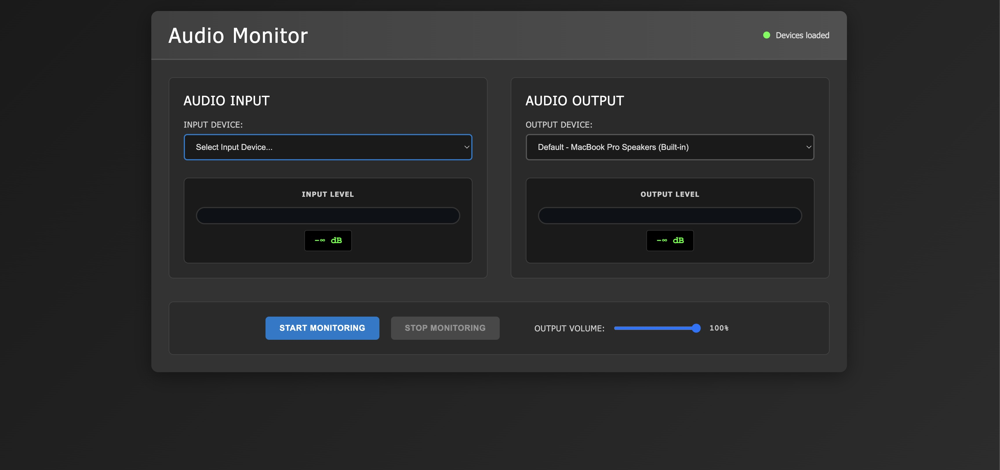

# Audio Monitor

A web-based audio monitoring interface that allows users to route hardware audio inputs to outputs while providing real-time decibel level visualization. Built with vanilla JavaScript and Web Audio API, served via a lightweight Node.js HTTP server.

## Features

- 🎤 **Hardware Input Selection** - Choose from available audio input devices
- 🔊 **Hardware Output Selection** - Select audio output devices
- 📊 **Real-time Decibel Metering** - Visual level meters for both input and output
- 🎛️ **Volume Control** - Adjustable output volume with live preview
- 🔴 **Live Monitoring** - Start/stop audio monitoring with visual feedback
- ⚡ **Lightweight** - No dependencies, pure vanilla JavaScript

## Screenshot



## Installation

### Prerequisites

- Node.js (v14 or higher)
- A modern web browser with Web Audio API support

### Setup Options

1. Use NPX:
```bash
npx audio-monitor
```

2. Install the package globally (optional):
```bash
npm install -g .
audio-monitor
```

### Command Line Options

```bash
audio-monitor [options]

Options:
  --port, -p    Port to run the server on (default: 3000)
  --host, -h    Host to run the server on (default: localhost)
  --browser, -b Open the default browser to the server URL
  --help        Show help message
```

### Usage Examples

```bash
# Start on default port 3000
npx audio-monitor

# When installed globally
audio-monitor

# Start on custom port and open browser
audio-monitor --port 8080 --browser

# Bind to all interfaces
audio-monitor --host 0.0.0.0 --port 3000
```

## How to Use the Interface

1. **Open the application** in your web browser at `http://localhost:3000` (default host/port)
2. **Grant microphone permissions** when prompted by your browser
3. **Select an input device** from the dropdown menu
4. **Select an output device** for audio playback or use system default
5. **Click "Start Monitoring"** to begin real-time audio monitoring
6. **Adjust volume** using the output volume slider
7. **Monitor levels** using the visual decibel meters
8. **Click "Stop Monitoring"** to end the session

### Browser Compatibility

- Chrome/Edge (recommended)
- Firefox
- Safari (with some limitations)
